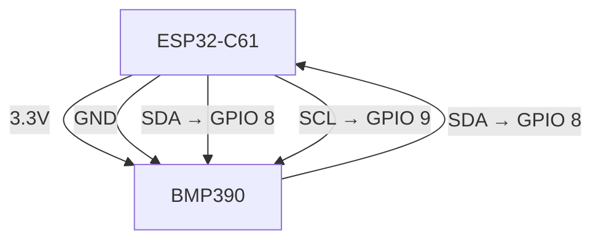
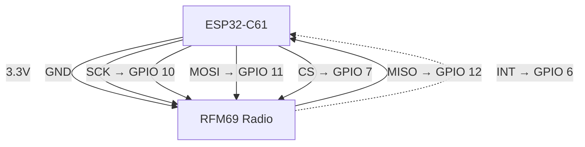
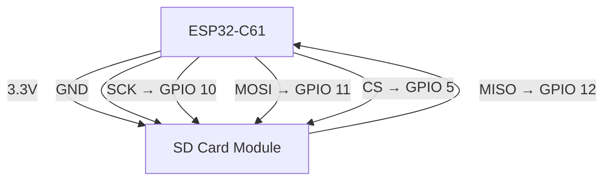
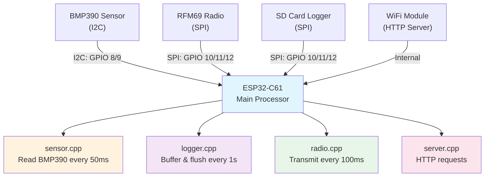
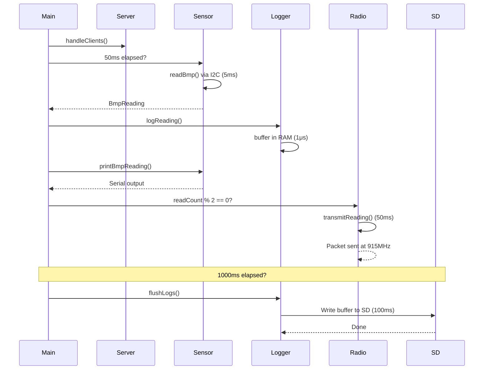

# Georges Rocket Sensor - Flight Computer Documentation

**Project:** ESP32-based telemetry system for high-powered rocketry  
**Target Hardware:** ESP32-C61  
**Status:** L3 Certification Project

---

## PART 1: USER GUIDE

### Overview

The Georges Rocket Sensor is a **flight computer** that records and transmits barometric data during rocket flight. It continuously measures:
- **Altitude** (calculated from atmospheric pressure)
- **Atmospheric Pressure** (raw sensor data)
- **Temperature** (onboard calibration)

Data is simultaneously:
1. **Logged to SD card** (local storage, survives rocket impact)
2. **Transmitted via RFM69 radio** (real-time telemetry to ground station)
3. **Served via WiFi HTTP** (live dashboard during testing)

**Why this design?**
- **Redundancy:** SD card works even if radio fails
- **Timing:** Pressure readings at configurable intervals (default: 50ms)
- **Wireless:** RFM69 transmits every 2nd reading, reducing power draw
- **Testing:** Built-in HTTP server for preflight verification

---

### Quick Start (5 minutes)

**Prerequisites:**
- ESP32-C61 development board
- USB cable (programming + power)
- Arduino IDE **or** ESP-IDF + CMake

**Step 1: Clone the repo with dependencies**
```bash
git clone --recursive https://github.com/MichaelADiazM/George-L2-and-L3-Electronics-Hell.git
cd George-L2-and-L3-Electronics-Hell
```

**Step 2: Configure (if needed)**
Edit `main/config.h` to set your:
- WiFi SSID/password
- I2C pins (SDA/SCL for BMP390)
- SPI pins (for RFM69 radio + SD card)
- Read interval (default 50ms is fine)

**Step 3: Build & Flash**

*Using Arduino IDE:*
```
File → Open → main/main.ino
Select Tools → Board: "ESP32-C61"
Click Upload
```

*Using ESP-IDF:*
```bash
idf.py build
idf.py flash
idf.py monitor  # View serial output
```

**Step 4: Verify**
1. Open Serial Monitor (115200 baud)
2. You should see:
   ```
   [main] Starting...
   [main: sensor] Sensor init OK
   [main: server] Server init OK
   [main: logger] Logger init OK
   [main: radio] Radio init OK
   ```
3. Visit `http://esp32.local/` to see live pressure/temperature

---

### Hardware Wiring Guide

#### Pin Connection Overview

Wire one device at a time. Each diagram below shows only that device's connections — follow it top to bottom (power first, then signal wires) and you won't have to trace overlapping lines.

**How to read every diagram on this page:**
| Line style | Meaning |
|---|---|
| `──▶` (solid arrow) | A wire carrying a signal, pointing the direction it travels |
| `┄┄▶` (dashed arrow) | Interrupt — the device signals the ESP32 asynchronously |

**1. BMP390 Pressure Sensor — wire this first (I2C, isolated bus, nothing shared)**


*SDA carries data both directions on the same wire — that's normal for I2C, not a wiring mistake.*

**2. RFM69 Radio — wire second (shares the SPI bus with the SD card below)**



**3. SD Card Module — wire third (same SCK/MOSI/MISO pins as the radio, different CS)**


*Notice SCK, MOSI, and MISO here are the exact same pins as the radio's diagram above — that's the shared SPI bus. Only CS is different (GPIO 5 instead of GPIO 7), which is what lets the ESP32 talk to one device without the other interfering.*

**Bus Sharing Summary:**

```
I2C Bus (GPIO 8, 9):
  └─ BMP390 Sensor (Address: 0x77)

SPI Bus (GPIO 10, 11, 12) - SHARED:
  ├─ RFM69 Radio (CS: GPIO 7, INT: GPIO 6)
  └─ SD Card Module (CS: GPIO 5)

Power:
  ├─ All modules: 3.3V + GND
  └─ Total current: ~150mA peak (during radio transmission)
```

**Key Notes:**
- ⚠️ **GPIO 10, 11, 12 are shared** between radio and SD card (same SPI bus)
- ✅ Each has its own **Chip Select (CS)** pin so they don't conflict
- ✅ I2C bus is **isolated** (only BMP390)
- ✅ Pull-ups on I2C lines (typically 4.7kΩ resistors, already on sensor module)

---

#### BMP390 Pressure Sensor (I2C)
| BMP390 | ESP32-C61 | Purpose |
|--------|-----------|---------|
| VCC    | 3.3V      | Power   |
| GND    | GND       | Ground  |
| SDA    | GPIO 8    | I2C Data|
| SCL    | GPIO 9    | I2C Clock|

#### RFM69 Radio Module (SPI)
| RFM69  | ESP32-C61 | Purpose |
|--------|-----------|---------|
| VCC    | 3.3V      | Power   |
| GND    | GND       | Ground  |
| MOSI   | GPIO 11   | SPI Data Out |
| MISO   | GPIO 12   | SPI Data In  |
| SCK    | GPIO 10   | SPI Clock    |
| CS     | GPIO 7    | Chip Select  |
| INT    | GPIO 6    | Interrupt    |

#### SD Card Module (SPI, shared bus with RFM69)
| SD Mod | ESP32-C61 | Purpose |
|--------|-----------|---------|
| VCC    | 3.3V      | Power   |
| GND    | GND       | Ground  |
| MOSI   | GPIO 11   | SPI Data (shared) |
| MISO   | GPIO 12   | SPI Data (shared) |
| SCK    | GPIO 10   | SPI Clock (shared) |
| CS     | GPIO 5    | Chip Select (separate) |

**Note:** MOSI, MISO, SCK are shared between RFM69 and SD card. Each has its own CS pin.

---

### Building the Project

#### Option A: Arduino IDE (Easiest)
1. Install ESP32 board support via Boards Manager
2. Open `main/main.ino`
3. Select Board: **ESP32-C61** (or closest variant)
4. Click **Upload**

#### Option B: ESP-IDF from Command Line (Recommended for CI/CD)

**First-time setup:**
```bash
# Install ESP-IDF (if not already done)
git clone https://github.com/espressif/esp-idf.git
cd esp-idf
git checkout v6.0.1
./install.sh

# Activate ESP-IDF environment
source export.sh  # or export.bat on Windows
cd ../Georges_RocketSensor
```

**Build and flash:**
```bash
idf.py build          # Compile
idf.py flash          # Upload to board
idf.py monitor        # Watch serial output (Ctrl+] to exit)
```

**Clean build (if things are weird):**
```bash
idf.py fullclean
idf.py build
idf.py flash
```

#### Understanding the Build System

The project uses **CMake + ESP-IDF** (not the Arduino IDE's build system). This means:

1. **CMakeLists.txt** defines what to compile:
   - Main source files (main.cpp, sensor.cpp, radio.cpp, logger.cpp, server.cpp)
   - External libraries (RadioHead, Adafruit sensor libs) as **git submodules**
   - Include paths and compiler flags

2. **Git submodules** manage dependencies:
   - `main/libraries/RadioHead/` — RFM69 driver
   - `main/libraries/Adafruit_BMP3XX_Library/` — Pressure sensor
   - `main/libraries/Adafruit_BusIO/` — I2C/SPI helper
   - `main/libraries/Adafruit_Unified_Sensor/` — Sensor base class

   When cloning, use `--recursive` to get all of these.

3. **sdkconfig** configures the ESP-IDF framework:
   - Arduino autostart enabled
   - Partition table set to SINGLE_APP_LARGE (more flash space)
   - Debug optimizations

---

### Flashing to Hardware

**Using esptool.py (universal method):**
```bash
pip install esptool
esptool.py -p COM3 -b 460800 --after hard_reset write_flash \
  0x1000 build/bootloader/bootloader.bin \
  0x8000 build/partition_table/partition-table.bin \
  0x10000 build/Georges_RocketSensor.bin
```
Replace `COM3` with your serial port (Windows: COMx; Linux/Mac: /dev/ttyUSBx)

**Using idf.py (easier):**
```bash
idf.py -p COM3 flash
```

---

### Troubleshooting

| Symptom | Cause | Fix |
|---------|-------|-----|
| "Port not found" | Board not connected | Check USB cable; try different port |
| Sensor reads all zeros | I2C wiring wrong | Verify GPIO 8/9; check pull-ups (4.7kΩ typical) |
| Radio transmits but not received | Wrong frequency | Check `config.h` RFM69_FREQUENCY_MHZ matches receiver |
| SD card not logging | SD card not inserted | Insert and format to FAT32 |
| WiFi dashboard not loading | Not on same network | Check config.h SSID/password |
| Serial monitor garbage | Baud rate mismatch | Set to 115200 baud |

---

## PART 2: TECHNICAL DEEP DIVE

### System Architecture



**Key Design Principles:**
1. **Interrupt-driven I2C/SPI** — Sensors and radio don't block the main loop
2. **Ring buffer logging** — Readings buffered in RAM, flushed to SD periodically
3. **Non-blocking HTTP** — Server handles requests without pausing sensor reads
4. **Polling interval (50ms)** — Chosen to match BMP390's ~100Hz output data rate

---

### Component Reference

#### 1. Sensor Module (`sensor.h / sensor.cpp`)

**Responsibility:** Read BMP390 via I2C, convert raw data to altitude/pressure/temp.

**Key Functions:**
```cpp
bool initSensor();                          // Initialize I2C, configure BMP390
BmpReading readBmp();                       // Read latest sensor data
void printBmpReading(const BmpReading& r);  // Debug output to Serial
```

**Data Structure:**
```cpp
struct BmpReading {
    float pressure;       // Atmospheric pressure (hPa)
    float temperatureC;   // Temperature (°C)
    float altitudeM;      // Calculated altitude (meters, relative to sea level)
    bool valid;           // Whether read succeeded
};
```

**Altitude Calculation:**
Uses the barometric formula: `h = 44330 × (1 - (P/P0)^(1/5.255))`
where P = current pressure, P0 = sea level reference (typically 1013.25 hPa)

**I2C Interface:**
- Address: 0x77 (default)
- Pins: GPIO 8 (SDA), GPIO 9 (SCL)
- Sample rate: Configurable via BMP390 OSR (over-sampling ratio)

---

#### 2. Logger Module (`logger.h / logger.cpp`)

**Responsibility:** Buffer sensor readings in RAM, periodically flush to SD card.

**Key Functions:**
```cpp
bool initLogger();                                      // Initialize SD card, open file
void logReading(unsigned long timestamp, const BmpReading& reading);  // Buffer a reading
void flushLogs();                                       // Write buffer to SD
```

**Why buffering?**
- SD card writes are slow (~milliseconds per write)
- Reading every 50ms = 20 reads/second
- Buffering avoids blocking the sensor loop
- Flushed every 1 second = ~20 readings batched per write

**File Format:**
Logs stored in `readings.csv` on SD card:
```
timestamp,temperatureC,pressureHpa,altitudeM
1234567890,22.5,1013.25,125.0
1234567950,22.6,1013.20,128.2
...
```

**SD Card Interface:**
- SPI bus (GPIO 10/11/12 shared with radio)
- CS pin: GPIO 5 (separate from radio)
- File system: FAT32 (Arduino's SD library expects this)

---

#### 3. Radio Module (`radio.h / radio.cpp`)

**Responsibility:** Transmit sensor readings wirelessly via RFM69.

**Key Functions:**
```cpp
bool initRadio();                           // Initialize SPI, configure RFM69
void transmitReading(const RadioPacket& packet);  // Send one packet
```

**Data Structure:**
```cpp
struct __attribute__((packed)) RadioPacket {
    uint32_t timestamp_ms;   // Milliseconds since boot
    float temperatureC;      // Temperature
    float pressureHpa;       // Pressure
    float altitudeM;         // Altitude
};  // Total: 16 bytes (packed, no padding)
```

**Transmission Strategy:**
- Transmits every 2nd reading (every 100ms, not every 50ms)
- Reduces power draw and RF congestion
- Ground station can request retransmit if packet lost

**RFM69 Interface:**
- SPI bus (GPIO 10/11/12 shared with SD card)
- CS pin: GPIO 7 (separate)
- Interrupt pin: GPIO 6 (packet ready signal)
- Frequency: 915 MHz (configurable via config.h)
- Data rate: 250 kbps (RadioHead default)

---

#### 4. Server Module (`server.h / server.cpp`)

**Responsibility:** HTTP server for live telemetry viewing during testing.

**Routes:**
```
GET /           → HTML page with live readings (auto-refresh every 5s)
GET /data       → JSON: { "tempC": 22.5, "pressHpa": 1013.25, "altM": 125.0 }
```

**WiFi Interface:**
- Modes: STA (connect to external AP) or AP (broadcast own network)
- Default AP SSID: "RocketSensor", Password: see config.h
- MDNS: Responds to `http://esp32.local/`

**Use Case:**
- Pre-flight check: Verify sensor readings are sensible
- Ground testing: Monitor pressure/temperature before launch
- Post-flight (if WiFi available): Quick data review

---

#### 5. Build System

**CMakeLists.txt** orchestrates compilation:

```cmake
idf_component_register(
    SRCS                    # Source files to compile
        "main.cpp" "sensor.cpp" "radio.cpp" "logger.cpp" "server.cpp"
        "libraries/RadioHead/RH_*.cpp"
        "libraries/Adafruit_*/Adafruit_*.cpp"
    
    INCLUDE_DIRS            # Header search paths
        "." "libraries/RadioHead" "libraries/Adafruit_*"
    
    REQUIRES arduino        # Dependency: Arduino framework
)
```

**Dependencies (git submodules):**
All external libraries are pinned to specific commits:
```
git submodule add https://github.com/PaulStoffregen/RadioHead \
    main/libraries/RadioHead
```

When someone clones with `git clone --recursive`, they get exact versions you tested.

**Build artifacts:**
- `build/Georges_RocketSensor.bin` — Firmware image (flashed to device)
- `build/Georges_RocketSensor.elf` — Executable (debug symbols, can analyze crashes)
- `build/compile_commands.json` — IDE uses for code completion

---

### Data Flow & Timing

**Synchronous (one-per-loop):**
```
main loop():
  T=0ms:     Call handleClients()      ← Process any HTTP requests
  T=0ms:     Check if 50ms elapsed
  T=0-50ms:  If yes: Read sensor
             - readBmp() via I2C
             - logReading() to RAM buffer
             - printBmpReading() to Serial
             - Every 2nd read: transmitReading() via SPI
  T=50ms:    Check if 1000ms elapsed
  T=50ms:    If yes: flushLogs()       ← Write RAM buffer to SD card
  T=50ms:    Loop back to start
```

**Timing Constraints:**
- `readBmp()`: ~5ms (I2C communication)
- `logReading()`: ~1μs (RAM write)
- `transmitReading()`: ~50ms (SPI + radio transmission)
- `flushLogs()`: ~100ms (SD card I/O, blocks loop!)
- `handleClients()`: Variable (depends on HTTP requests)

**Important:** The `flushLogs()` call can block for up to 100ms. During that time, sensor reads are delayed, but the design tolerates this because the buffer already holds the missing samples.

---

### Module Interactions

#### Sequence: One Complete Read-Log-Transmit Cycle



**Key insight:** Modules operate **asynchronously** on different timescales:
- Sensor: every 50ms
- Radio: every 100ms
- Logger flush: every 1000ms
- HTTP: whenever a request comes in

This is why each module has its own timer (not a central scheduler).

---

### Configuration Reference

Edit `main/config.h` to customize behavior:

```cpp
// ── WiFi ──
#define NETWORK_SSID "MyNetwork"
#define NETWORK_PASS "password"
#define AP_SSID "RocketSensor"
#define AP_PASS "rocket123"

// ── Sensor ──
#define I2C_SDA_PIN 8
#define I2C_SCL_PIN 9
#define BMP_READ_INTERVAL_MS 50          // Read every 50ms
#define AP_SHUTOFF_ALTITUDE_M 10000      // Stop logging if above 10km (safety)

// ── Radio ──
#define RFM69_FREQUENCY_MHZ 915.0        // Must match receiver
#define RFM69_CS_PIN 7
#define RFM69_INT_PIN 6
#define MOSI_PIN 11
#define MISO_PIN 12
#define SCK_PIN 10

// ── SD Card ──
#define SD_CS_PIN 5

// ── Server ──
#define HTTP_PORT 80
```

**Common tweaks:**
- **Slower reads:** Change `BMP_READ_INTERVAL_MS` to 100 (reduces power)
- **Different radio freq:** Change `RFM69_FREQUENCY_MHZ` (match your ground station)
- **Larger altitude limit:** Change `AP_SHUTOFF_ALTITUDE_M` (if flying higher)

---

### Known Limitations & Future Work

1. **No redundancy in computation:** If sensor read fails, data is lost (could queue and retry)
2. **SD card blocks loop:** Large flush operations pause sensor reads temporarily
3. **HTTP server only on STA mode:** Can't browse dashboard while in AP mode
4. **No data compression:** CSV logs are uncompressed (could use gzip on payload)
5. **No telemetry encryption:** Radio packets unencrypted (add AES if needed)

---

### Maintenance & Debugging

**Enable serial logging:**
```cpp
Serial.begin(115200);
Serial.println("[sensor] Reading BMP390...");  // Add debug lines
```

**View logs via terminal:**
```bash
idf.py monitor -p COM3
# Or: screen /dev/ttyUSB0 115200
```

**Check SD card contents (post-flight):**
Remove SD card, plug into computer, open `readings.csv` in Excel/Python.

**Simulate without hardware:**
Use Arduino IDE simulator (no actual board needed for basic testing).

---

### Project Structure

```
Georges_RocketSensor/
├── main/
│   ├── main.ino              # Entry point (calls setup() and loop())
│   ├── main.cpp              # Actual C++ implementation
│   ├── config.h              # User-configurable constants
│   ├── sensor.h / .cpp       # BMP390 driver
│   ├── radio.h / .cpp        # RFM69 driver
│   ├── logger.h / .cpp       # SD card logger
│   ├── server.h / .cpp       # HTTP server
│   ├── CMakeLists.txt        # Build configuration
│   └── libraries/            # Git submodules (external dependencies)
│       ├── RadioHead/
│       ├── Adafruit_BMP3XX_Library/
│       ├── Adafruit_BusIO/
│       └── Adafruit_Unified_Sensor/
├── build/                    # Build artifacts (auto-generated)
│   ├── Georges_RocketSensor.bin
│   ├── Georges_RocketSensor.elf
│   └── compile_commands.json
├── .gitmodules              # Submodule configuration
├── sdkconfig                # ESP-IDF configuration
├── dependencies.lock        # Pinned dependency versions
└── README.md               # This file
```

---

### Contributing & Extending

**Adding a new sensor:**
1. Create `newsensor.h` / `.cpp` in `main/`
2. Follow the pattern: `bool initNewSensor()`, `struct NewReading`, `NewReading readNewSensor()`
3. Add to `main.cpp` loop
4. Document in this README

**Changing logging format:**
1. Edit `logger.cpp` header line (CSV columns)
2. Update `LogEntry` struct if adding fields
3. Test with `idf.py build && idf.py flash`

**Porting to different ESP32 variant:**
1. Change `sdkconfig` target: `CONFIG_IDF_TARGET="esp32s3"` (or your variant)
2. Update pin definitions in `config.h`
3. Rebuild: `idf.py fullclean && idf.py build`

---

## Feedback & Issue Reporting

Found a bug? Have a suggestion? Want to improve the documentation?

**Please reach out to the NSCRC team:**
📧 **NSCRocketryClub@seattlecolleges.edu**

When reporting issues, include:
- What you were trying to do
- What went wrong (error message, unexpected behavior)
- Your hardware setup (board variant, wiring)
- Steps to reproduce

Your feedback helps us maintain this system for future club members and L3 candidates.

---

**Last Updated:** September 2026  
**Maintainer:** North Seattle College Rocketry Club  
**Contact:** NSCRocketryClub@seattlecolleges.edu  
**L3 Certification:** Pending Flight Test
