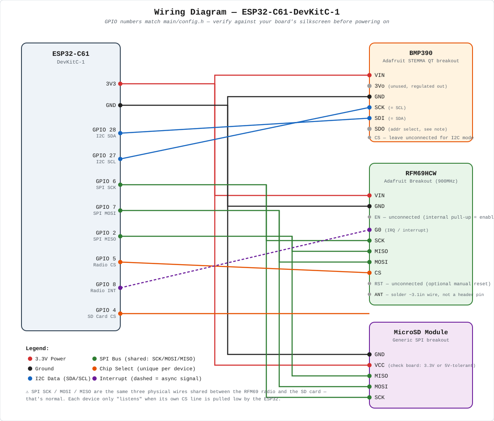
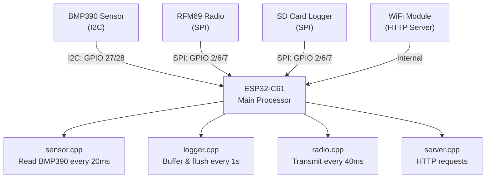
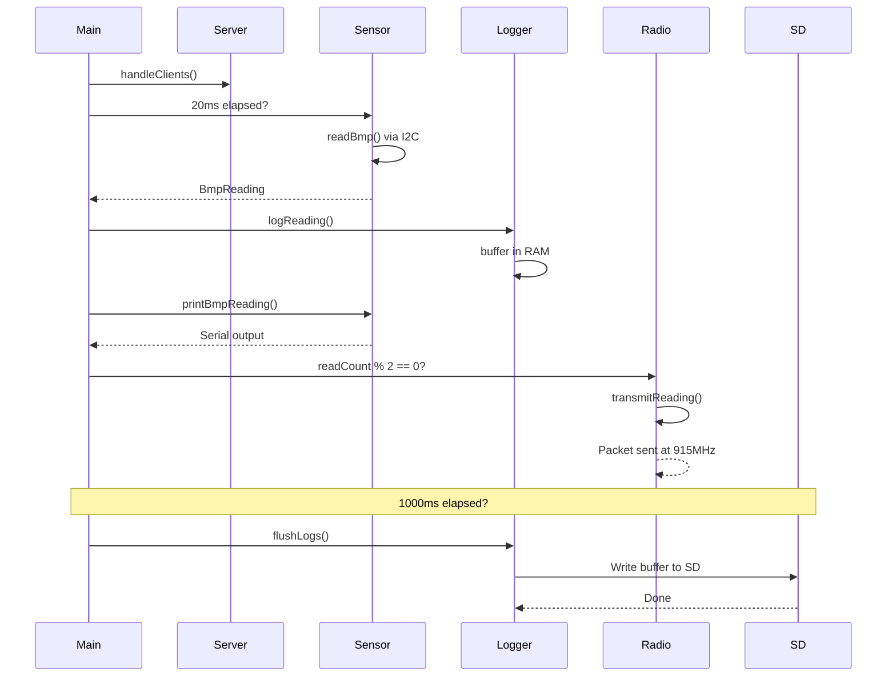

# Georges Rocket Sensor - Flight Computer Documentation

**Project:** ESP32-based telemetry system for high-powered rocketry  
**Target Hardware:** ESP32-C61  
**Status:** L3 Certification Project

---

## PART 1: USER GUIDE

### Overview

The Georges Rocket Sensor is a **flight computer** that records and transmits barometric data during rocket flight. It continuously measures:
- **Altitude** (calculated from atmospheric pressure)
- **Atmospheric Pressure** (raw sensor data)
- **Temperature** (onboard calibration)

Data is simultaneously:
1. **Logged to SD card** (local storage, survives rocket impact)
2. **Transmitted via RFM69 radio** (real-time telemetry to ground station)
3. **Served via WiFi HTTP** (live dashboard during testing)

**Why this design?**
- **Redundancy:** SD card works even if radio fails
- **Timing:** Pressure readings at configurable intervals (default: 20ms, via `BMP_READ_INTERVAL_MS`)
- **Wireless:** RFM69 transmits every 2nd reading, reducing power draw
- **Testing:** Built-in HTTP server for preflight verification

---

### Quick Start (5 minutes)

**Prerequisites:**
- ESP32-C61 development board
- USB cable (programming + power)
- Arduino IDE **or** ESP-IDF + CMake

**Step 1: Clone the repo with dependencies**
```bash
git clone --recursive https://github.com/MichaelADiazM/George-L2-and-L3-Electronics-Hell.git
cd George-L2-and-L3-Electronics-Hell
```

**Step 2: Configure (if needed)**
Edit `main/config.h` to set your:
- WiFi SSID/password
- I2C pins (SDA/SCL for BMP390)
- SPI pins (for RFM69 radio + SD card)
- Read interval (default 20ms is fine)

**Step 3: Build & Flash**

This project builds via **ESP-IDF only** — the ESP32-C61 is not yet a selectable board in Arduino IDE's Boards Manager (as of this writing), which is exactly why this project is structured as an ESP-IDF project with Arduino included as a component (`components/arduino`), rather than a plain Arduino sketch.

```bash
idf.py build
idf.py flash
idf.py monitor  # View serial output
```

**Step 4: Verify**
1. Open Serial Monitor (115200 baud)
2. You should see something like:
   ```
   [main] Starting...
   [sensor] BMP390 Ready.
   [server] AP IP: 192.168.4.1
   [server] Connected to <your network name>
   [server] IP address: <assigned IP>
   [server] MDNS responder started
   [server] HTTP server started
   ```
   Note: the logger and radio modules currently only print a message on **failure** (e.g. `[logger] SD card initialization failed.`), not on success — so if you don't see a logger/radio error, they initialized fine, even though there's no explicit confirmation line yet. If any `initModule()` call fails, you'll see `[main: <module>] Init failed. <hint>` and the board halts.
3. Visit `http://esp32.local:8080/` to see live pressure/temperature (note the port — `HTTP_PORT` in `config.h` is set to `8080`, not the default 80)

---

### Hardware Wiring Guide

**Hardware used:**
- **MCU:** Espressif ESP32-C61-DevKitC-1
- **Pressure sensor:** Adafruit BMP390 (STEMMA QT breakout)
- **Radio:** Adafruit RFM69HCW Breakout (900 MHz)
- **Storage:** Generic microSD SPI breakout module

#### Wiring Diagram



This diagram is generated from the real pin definitions in [`main/config.h`](main/config.h) and each board's actual pinout — if you change a pin in `config.h`, update this diagram to match (the source is [`docs/wiring-diagram.svg`](docs/wiring-diagram.svg), plain text/XML, editable in any text editor).

**How to read it:**
- Colored dots on each board are physical pins; the label next to each dot is that pin's name as printed on the board's silkscreen
- Lines are wires, color-coded by signal type (see legend on the diagram)
- The SPI lines (green — SCK/MOSI/MISO) branch to *both* the radio and the SD card, because they share one bus. Only the Chip Select (orange) line is unique per device — that's what lets the ESP32 address one without disturbing the other
- Gray dots/pins are present on the board but intentionally left unconnected — noted so you don't wonder if you're missing a wire

#### Bus Sharing Summary

```
I2C Bus (GPIO 28 = SDA, GPIO 27 = SCL):
  └─ BMP390 Sensor — isolated, nothing else on this bus

SPI Bus (GPIO 6 = SCK, GPIO 7 = MOSI, GPIO 2 = MISO) — SHARED:
  ├─ RFM69HCW Radio  (CS: GPIO 5, IRQ: GPIO 8)
  └─ SD Card Module  (CS: GPIO 4)

Power:
  ├─ All modules: 3.3V + GND
  └─ Total current: ~150mA peak (during radio transmission)
```

**Key Notes:**
- ⚠️ **GPIO 6, 7, 2 are shared** between the radio and SD card (same SPI bus) — this is intentional, not a wiring conflict
- ✅ Each device has its own **Chip Select (CS)** pin so they never talk over each other
- ✅ I2C bus is **isolated** (only the BMP390 is on it)
- ✅ If you change any pin in `config.h`, the diagram and tables below must be updated to match — they are documentation, not the source of truth (the code is)

---

#### Full Pinout Reference

These tables list **every** pin on each physical board — including ones this project doesn't use — so you know what's safe to leave alone and what a stray wire actually does.

**ESP32-C61-DevKitC-1 — pins used by this project**

| GPIO | Signal | Connects to |
|------|--------|-------------|
| 3V3  | Power  | All 3 peripherals |
| GND  | Ground | All 3 peripherals |
| GPIO 28 | I2C SDA | BMP390 SDI |
| GPIO 27 | I2C SCL | BMP390 SCK |
| GPIO 6  | SPI SCK  | RFM69 SCK + SD Card SCK (shared) |
| GPIO 7  | SPI MOSI | RFM69 MOSI + SD Card MOSI (shared) |
| GPIO 2  | SPI MISO | RFM69 MISO + SD Card MISO (shared) |
| GPIO 5  | Chip Select | RFM69 CS |
| GPIO 8  | Interrupt | RFM69 G0 (IRQ) |
| GPIO 4  | Chip Select | SD Card CS |

*All other GPIOs on the board are free for future expansion (e.g., a buzzer, status LED, or additional sensor).*

**BMP390 (Adafruit STEMMA QT breakout) — all 7 header pins**

| Pin | Purpose | Wired? |
|-----|---------|--------|
| VIN | Power in (3–5V, onboard regulator) | ✅ → 3V3 |
| 3Vo | Regulated 3.3V output | ❌ Not used |
| GND | Ground | ✅ → GND |
| SCK | I2C clock (= SCL) | ✅ → GPIO 27 |
| SDI | I2C data (= SDA) | ✅ → GPIO 28 |
| SDO | I2C address select | ❌ Leave as board default, or check with an I2C scanner if the sensor isn't found at the expected address (0x76 vs 0x77) |
| CS  | Chip select — pull high/leave open for I2C mode | ❌ Leave unconnected |

**RFM69HCW (Adafruit Breakout, 900 MHz) — all 10 header pins**

| Pin | Purpose | Wired? |
|-----|---------|--------|
| VIN | Power in | ✅ → 3V3 |
| GND | Ground | ✅ → GND |
| EN  | Enable (internal pull-up = enabled by default) | ❌ Not used |
| G0  | Interrupt / packet-ready signal | ✅ → GPIO 8 |
| SCK | SPI clock | ✅ → GPIO 6 |
| MISO | SPI data out (device → ESP32) | ✅ → GPIO 2 |
| MOSI | SPI data in (ESP32 → device) | ✅ → GPIO 7 |
| CS  | Chip select | ✅ → GPIO 5 |
| RST | Manual reset (optional) | ❌ Not used |
| ANT | Antenna connection point (not a header pin — solder ~3.1in wire for 915 MHz) | ⚠️ Required, but not a wire to the ESP32 |

**MicroSD Module (generic SPI breakout) — all 6 pins**

| Pin | Purpose | Wired? |
|-----|---------|--------|
| GND | Ground | ✅ → GND |
| VCC | Power in — **check your specific board**; some are 5V-only with onboard regulator, others expect 3.3V directly | ✅ → 3V3 (verify first!) |
| MISO | SPI data out | ✅ → GPIO 2 |
| MOSI | SPI data in | ✅ → GPIO 7 |
| SCK | SPI clock | ✅ → GPIO 6 |
| CS  | Chip select | ✅ → GPIO 4 |

---

### Building the Project

This project builds via **ESP-IDF only.** The ESP32-C61 is not yet a selectable board in Arduino IDE's Boards Manager, so a plain Arduino sketch isn't an option here — instead, this project is an ESP-IDF project with Arduino included as a component (`components/arduino`), giving you the familiar `setup()`/`loop()` API while ESP-IDF handles the actual chip support.

**First-time setup:**
```bash
# Install ESP-IDF (if not already done)
git clone https://github.com/espressif/esp-idf.git
cd esp-idf
git checkout v6.0.1
./install.sh

# Activate ESP-IDF environment
source export.sh  # or export.bat on Windows
cd ../Georges_RocketSensor
```

**Build and flash:**
```bash
idf.py build          # Compile
idf.py flash          # Upload to board
idf.py monitor        # Watch serial output (Ctrl+] to exit)
```

**Clean build (if things are weird):**
```bash
idf.py fullclean
idf.py build
idf.py flash
```

#### Understanding the Build System

The project uses **CMake + ESP-IDF** (not the Arduino IDE's build system). This means:

1. **CMakeLists.txt** defines what to compile:
   - Main source files (main.cpp, sensor.cpp, radio.cpp, logger.cpp, server.cpp)
   - External libraries (RadioHead, Adafruit sensor libs) as **git submodules**
   - Include paths and compiler flags

2. **Git submodules** manage dependencies:
   - `main/libraries/RadioHead/` — RFM69 driver
   - `main/libraries/Adafruit_BMP3XX_Library/` — Pressure sensor
   - `main/libraries/Adafruit_BusIO/` — I2C/SPI helper
   - `main/libraries/Adafruit_Unified_Sensor/` — Sensor base class

   When cloning, use `--recursive` to get all of these.

3. **sdkconfig** configures the ESP-IDF framework:
   - Arduino autostart enabled
   - Partition table set to SINGLE_APP_LARGE (more flash space)
   - Debug optimizations

---

### Flashing to Hardware

**Using esptool.py (universal method):**
```bash
pip install esptool
esptool.py -p COM3 -b 460800 --after hard_reset write_flash \
  0x1000 build/bootloader/bootloader.bin \
  0x8000 build/partition_table/partition-table.bin \
  0x10000 build/Georges_RocketSensor.bin
```
Replace `COM3` with your serial port (Windows: COMx; Linux/Mac: /dev/ttyUSBx)

**Using idf.py (easier):**
```bash
idf.py -p COM3 flash
```

---

### Troubleshooting

| Symptom | Cause | Fix |
|---------|-------|-----|
| "Port not found" | Board not connected | Check USB cable; try different port |
| Sensor reads all zeros | I2C wiring wrong | Verify GPIO 27/28 (see wiring diagram); check pull-ups (4.7kΩ typical) |
| Sensor not found on boot | Wrong I2C address | BMP390 may be at 0x76 or 0x77 depending on SDO pin — run `main/i2c_scanner_test.ino.bak` (rename to `.ino` in its own sketch folder) to confirm which address responds |
| Radio transmits but not received | Wrong frequency | Check `config.h` RFM69_FREQUENCY_MHZ matches receiver |
| SD card not logging | SD card not inserted | Insert and format to FAT32 |
| WiFi dashboard not loading | Not on same network | Check config.h SSID/password |
| Serial monitor garbage | Baud rate mismatch | Set to 115200 baud |

---

## PART 2: TECHNICAL DEEP DIVE

### System Architecture



**Key Design Principles:**
1. **Interrupt-driven I2C/SPI** — Sensors and radio don't block the main loop
2. **Ring buffer logging** — Readings buffered in RAM, flushed to SD periodically
3. **Non-blocking HTTP** — Server handles requests without pausing sensor reads
4. **Polling interval (20ms, set by `BMP_READ_INTERVAL_MS`)** — Note: this is *faster* than the BMP390's configured output data rate (`BMP3_ODR_25_HZ` = a new sample every 40ms in `sensor.cpp`), so some polls will re-read the same underlying sample. This isn't necessarily wrong (it bounds worst-case latency), but it's worth knowing if you're tuning for power or exact sample timing.

---

### Component Reference

#### 1. Sensor Module (`sensor.h / sensor.cpp`)

**Responsibility:** Read BMP390 via I2C, convert raw data to altitude/pressure/temp.

**Key Functions:**
```cpp
bool initSensor();                          // Initialize I2C, configure BMP390
BmpReading readBmp();                       // Read latest sensor data
void printBmpReading(const BmpReading& r);  // Debug output to Serial
```

**Data Structure:**
```cpp
struct BmpReading {
    float pressure;       // Atmospheric pressure (hPa)
    float temperatureC;   // Temperature (°C)
    float altitudeM;      // Calculated altitude (meters, relative to sea level)
    bool valid;           // Whether read succeeded
};
```

**Altitude Calculation:**
Uses the barometric formula: `h = 44330 × (1 - (P/P0)^(1/5.255))`
where P = current pressure, P0 = sea level reference pressure. In this codebase, P0 is set via `SEALEVELPRESSURE_HPA` in `sensor.cpp`, hardcoded to `1013.25` hPa — the standard ICAO reference value (the same default used in Adafruit's own example code).

**Why this matters:** actual sea-level pressure varies day to day and place to place with the weather — it isn't always exactly 1013.25 hPa. Because P0 is fixed at compile time rather than measured on launch day, the altitude this code reports is *relative to the standard atmosphere*, not necessarily *relative to the ground you're launching from*. In practice this mostly shows up as a constant offset (your "altitude" at the pad might read as some nonzero value instead of 0), which is usually fine for tracking *relative* altitude gain during flight, but worth knowing if you need absolute AGL accuracy — you'd want to read the current local QNH before launch and update `SEALEVELPRESSURE_HPA`, or better, zero the altitude against the launch-pad reading in software.

**I2C Interface:**
- Address: 0x77 (default) or 0x76, depending on the SDO pin — confirm with `main/i2c_scanner_test.ino.bak` (rename to `.ino` in its own sketch folder) if the sensor isn't detected
- Pins: GPIO 28 (SDA), GPIO 27 (SCL)
- Sample rate: Configurable via BMP390 OSR (over-sampling ratio)

---

#### 2. Logger Module (`logger.h / logger.cpp`)

**Responsibility:** Buffer sensor readings in RAM, periodically flush to SD card.

**Key Functions:**
```cpp
bool initLogger();                                      // Initialize SD card, open file
void logReading(unsigned long timestamp, const BmpReading& reading);  // Buffer a reading
void flushLogs();                                       // Write buffer to SD
```

**Why buffering?**
- SD card writes are slow (~milliseconds per write)
- Reading every 20ms (per `BMP_READ_INTERVAL_MS` in `config.h`) = 50 reads/second
- Buffering avoids blocking the sensor loop
- Flushed every 1 second = ~50 readings batched per write

**File Format:**
Logs stored in `readings.csv` on SD card:
```
timestamp,temperatureC,pressureHpa,altitudeM
1234567890,22.5,1013.25,125.0
1234567950,22.6,1013.20,128.2
...
```

**SD Card Interface:**
- SPI bus (GPIO 6/7/2 = SCK/MOSI/MISO, shared with radio)
- CS pin: GPIO 4 (separate from radio's GPIO 5)
- File system: FAT32 (Arduino's SD library expects this)

---

#### 3. Radio Module (`radio.h / radio.cpp`)

**Responsibility:** Transmit sensor readings wirelessly via RFM69.

**Key Functions:**
```cpp
bool initRadio();                           // Initialize SPI, configure RFM69
void transmitReading(const RadioPacket& packet);  // Send one packet
```

**Data Structure:**
```cpp
struct __attribute__((packed)) RadioPacket {
    uint32_t timestamp_ms;   // Milliseconds since boot
    float temperatureC;      // Temperature
    float pressureHpa;       // Pressure
    float altitudeM;         // Altitude
};  // Total: 16 bytes (packed, no padding)
```

**Transmission Strategy:**
- Transmits every 2nd reading (every 40ms, given the 20ms `BMP_READ_INTERVAL_MS`)
- Reduces power draw and RF congestion
- Ground station can request retransmit if packet lost

**RFM69 Interface:**
- SPI bus (GPIO 6/7/2 = SCK/MOSI/MISO, shared with SD card)
- CS pin: GPIO 5 (separate from SD card's GPIO 4)
- Interrupt pin: GPIO 8 (packet ready signal)
- Frequency: 915 MHz (configurable via config.h)
- Data rate: 250 kbps (RadioHead default)

---

#### 4. Server Module (`server.h / server.cpp`)

**Responsibility:** HTTP server for live telemetry viewing during testing.

**Routes (as actually implemented in `server.cpp`):**
```
GET /   → HTML "Ground Station" page showing Pressure (hPa), Temperature (°C), Altitude (m)
          Auto-refreshes every 4 seconds via <meta http-equiv='refresh' content='4'>
```
There is currently **no `/data` JSON endpoint** — only the `/` HTML page exists. (An earlier version of this doc incorrectly documented a `/data` route; if you want one, `server.cpp`'s `handleRoot()` is the place to add a second `server.on(...)` handler.)

**WiFi Interface:**
- Mode: `WIFI_AP_STA` — the ESP32 runs **both simultaneously**: it broadcasts its own access point *and* connects to an existing network at the same time. It is not an either/or choice.
- AP SSID/password: `AP_SSID` / `AP_PASS` in `config.h` (currently `"rocketfinder"` / `"findmefather"`) — the ESP32's own AP IP is the standard `192.168.4.1`
- STA network: connects to `NETWORK_SSID` / `NETWORK_PASS` in `config.h`; if it can't connect within `WIFI_TIMEOUT_MS` (10 seconds), `initServer()` returns `false` and the board halts
- Server port: `HTTP_PORT` in `config.h` (currently `8080`, not the default port 80)
- MDNS hostname: registered as `"esp32"` — responds to `http://esp32.local:8080/` (the port must be included, since it's non-default)

**Use Case:**
- Pre-flight check: Verify sensor readings are sensible
- Ground testing: Monitor pressure/temperature before launch
- Post-flight (if WiFi available): Quick data review

---

#### 5. Build System

**CMakeLists.txt** orchestrates compilation:

```cmake
idf_component_register(
    SRCS                    # Source files to compile
        "main.cpp" "sensor.cpp" "radio.cpp" "logger.cpp" "server.cpp"
        "libraries/RadioHead/RH_*.cpp"
        "libraries/Adafruit_*/Adafruit_*.cpp"
    
    INCLUDE_DIRS            # Header search paths
        "." "libraries/RadioHead" "libraries/Adafruit_*"
    
    REQUIRES arduino        # Dependency: Arduino framework
)
```

**Dependencies (git submodules):**
All external libraries are pinned to specific commits:
```
git submodule add https://github.com/PaulStoffregen/RadioHead \
    main/libraries/RadioHead
```

When someone clones with `git clone --recursive`, they get exact versions you tested.

**Build artifacts:**
- `build/Georges_RocketSensor.bin` — Firmware image (flashed to device)
- `build/Georges_RocketSensor.elf` — Executable (debug symbols, can analyze crashes)
- `build/compile_commands.json` — IDE uses for code completion

---

### Data Flow & Timing

**Synchronous (one-per-loop):**
```
main loop():
  T=0ms:     Call handleClients()      ← Process any HTTP requests
  T=0ms:     Check if BMP_READ_INTERVAL_MS (20ms) elapsed
  T=0-20ms:  If yes: Read sensor
             - readBmp() via I2C
             - logReading() to RAM buffer
             - printBmpReading() to Serial
             - Every 2nd read (i.e. every 40ms): transmitReading() via SPI
  T=20ms:    Check if 1000ms elapsed (hardcoded in main.cpp, not a config.h value)
  T=20ms:    If yes: flushLogs()       ← Write RAM buffer to SD card
  T=20ms:    Loop back to start
```

**Timing Constraints (approximate — not independently measured on this hardware):**
- `readBmp()`: a few ms (I2C communication; exact time depends on the configured oversampling — currently 8x temp / 4x pressure)
- `logReading()`: sub-microsecond (RAM write)
- `transmitReading()`: on the order of a few ms for a 16-byte packet at RadioHead's 250 kbps default, plus preamble/sync overhead
- `flushLogs()`: highly variable, SD card dependent — can be tens of ms
- `handleClients()`: Variable (depends on HTTP requests)

**Important:** The BMP390 is configured for a 25 Hz output data rate (`BMP3_ODR_25_HZ` in `sensor.cpp`, i.e. a new sample roughly every 40ms), but the loop polls it every 20ms (`BMP_READ_INTERVAL_MS`). That means roughly every other poll can return the same underlying sample rather than fresh data. Not a bug — it bounds worst-case read latency — but worth knowing if you're correlating timestamps to real-world sensor updates.

Separately, `flushLogs()` can block the loop for a nontrivial, SD-card-dependent duration. During that time, sensor reads are delayed, but the design tolerates this because the buffer already holds the missing samples.

---

### Module Interactions

#### Sequence: One Complete Read-Log-Transmit Cycle



**Key insight:** Modules operate **asynchronously** on different timescales:
- Sensor: every 20ms (`BMP_READ_INTERVAL_MS`)
- Radio: every 40ms (every 2nd sensor reading)
- Logger flush: every 1000ms (hardcoded in `main.cpp`)
- HTTP: whenever a request comes in

This is why each module has its own timer (not a central scheduler).

---

### Configuration Reference

Edit `main/config.h` to customize behavior:

```cpp
// ── WiFi ──
#define NETWORK_SSID   "networkname"
#define NETWORK_PASS   "password"
#define AP_SSID        "rocketfinder"
#define AP_PASS        "findmefather"
#define WIFI_TIMEOUT_MS 10000

// ── Sensor ──
#define I2C_SDA_PIN 28
#define I2C_SCL_PIN 27

#define MISO_PIN 2
#define MOSI_PIN 7
#define SCK_PIN 6
#define RFM69_CS_PIN 5
#define RFM69_INT_PIN 8
#define SD_CS_PIN 4

// Poll interval: BMP390 output data rate at current OSR settings
#define BMP_READ_INTERVAL_MS 20

// Threshold for AP shutoff according to altitude
#define AP_SHUTOFF_ALTITUDE_M 0

// ── Radio ──
constexpr float RFM69_FREQUENCY_MHZ = 915.0f;

// ── Server ──
#define HTTP_PORT 8080
```
*This block mirrors [`main/config.h`](main/config.h) exactly as of the last README update — always check the actual file if there's any doubt, since it's the single source of truth.*

**Common tweaks:**
- **Slower reads:** Increase `BMP_READ_INTERVAL_MS` (reduces power draw, at the cost of data resolution)
- **Different radio freq:** Change `RFM69_FREQUENCY_MHZ` (must match your ground station's receiver)
- **Re-enable AP altitude shutoff:** Set `AP_SHUTOFF_ALTITUDE_M` above 0 (currently disabled)

---

### Known Limitations & Future Work

1. **No redundancy in computation:** If sensor read fails, data is lost (could queue and retry)
2. **SD card blocks loop:** Large flush operations pause sensor reads temporarily
3. **No JSON/API endpoint:** `server.cpp` only serves the `/` HTML dashboard — there's no machine-readable `/data` route, so anything wanting programmatic access (a ground-station app, a logging script) would need to scrape HTML or a new endpoint added
4. **No data compression:** CSV logs are uncompressed (could use gzip on payload)
5. **No telemetry encryption:** Radio packets unencrypted (add AES if needed)
6. **Fixed sea-level pressure reference:** `SEALEVELPRESSURE_HPA` in `sensor.cpp` is hardcoded to the standard 1013.25 hPa rather than read from `config.h` or set at runtime — see the Altitude Calculation note in the Sensor Module section above

---

### Maintenance & Debugging

**Enable serial logging:**
```cpp
Serial.begin(115200);
Serial.println("[sensor] Reading BMP390...");  // Add debug lines
```

**View logs via terminal:**
```bash
idf.py monitor -p COM3
# Or: screen /dev/ttyUSB0 115200
```

**Check SD card contents (post-flight):**
Remove SD card, plug into computer, open `readings.csv` in Excel/Python.

**Simulate without hardware:**
Use Arduino IDE simulator (no actual board needed for basic testing).

---

### Project Structure

```
Georges_RocketSensor/
├── main/
│   ├── main.cpp               # Entry point (setup() and loop())
│   ├── config.h              # User-configurable constants
│   ├── sensor.h / .cpp       # BMP390 driver
│   ├── radio.h / .cpp        # RFM69 driver
│   ├── logger.h / .cpp       # SD card logger
│   ├── server.h / .cpp       # HTTP server
│   ├── CMakeLists.txt        # Build configuration
│   └── libraries/            # Git submodules (external dependencies)
│       ├── RadioHead/
│       ├── Adafruit_BMP3XX_Library/
│       ├── Adafruit_BusIO/
│       └── Adafruit_Unified_Sensor/
├── build/                    # Build artifacts (auto-generated)
│   ├── Georges_RocketSensor.bin
│   ├── Georges_RocketSensor.elf
│   └── compile_commands.json
├── .gitmodules              # Submodule configuration
├── sdkconfig                # ESP-IDF configuration
├── dependencies.lock        # Pinned dependency versions
└── README.md               # This file
```

---

### Contributing & Extending

**Adding a new sensor:**
1. Create `newsensor.h` / `.cpp` in `main/`
2. Follow the pattern: `bool initNewSensor()`, `struct NewReading`, `NewReading readNewSensor()`
3. Add to `main.cpp` loop
4. Document in this README

**Changing logging format:**
1. Edit `logger.cpp` header line (CSV columns)
2. Update `LogEntry` struct if adding fields
3. Test with `idf.py build && idf.py flash`

**Porting to different ESP32 variant:**
1. Change `sdkconfig` target: `CONFIG_IDF_TARGET="esp32s3"` (or your variant)
2. Update pin definitions in `config.h`
3. Rebuild: `idf.py fullclean && idf.py build`

---

## Feedback & Issue Reporting

Found a bug? Have a suggestion? Want to improve the documentation?

**Please reach out to the NSCRC team:**
📧 **NSCRocketryClub@seattlecolleges.edu**

When reporting issues, include:
- What you were trying to do
- What went wrong (error message, unexpected behavior)
- Your hardware setup (board variant, wiring)
- Steps to reproduce

Your feedback helps us maintain this system for future club members and L3 candidates.

---

**Last Updated:** September 2026  
**Maintainer:** North Seattle College Rocketry Club  
**Contact:** NSCRocketryClub@seattlecolleges.edu  
**L3 Certification:** Pending Flight Test

---

*This documentation was co-authored with Claude (Sonnet and Haiku models) via Claude Code.*
