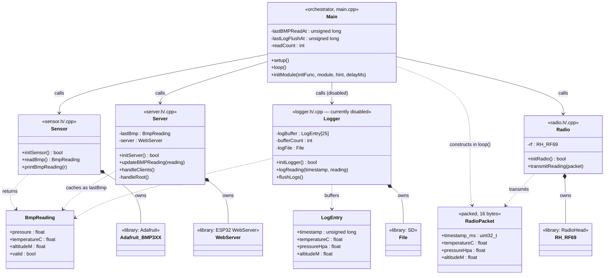
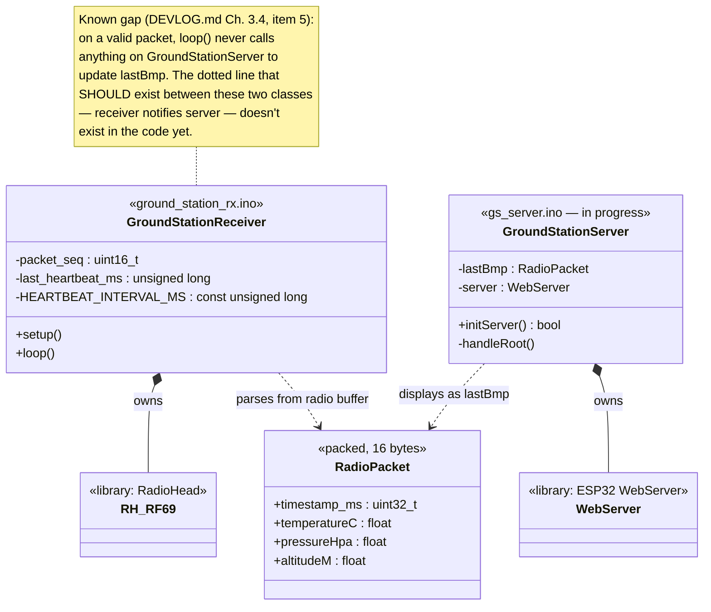
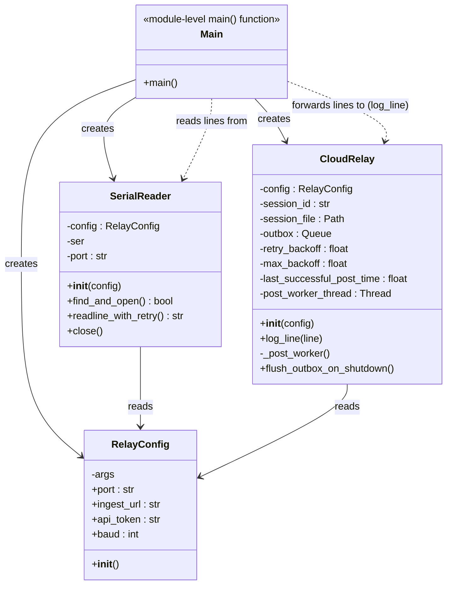
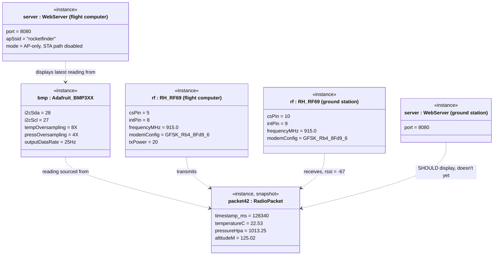

# UML — Georges Rocket Sensor

Companion to [`DEVLOG.md`](DEVLOG.md). That document explains *why* each piece exists; this one shows the *shape* of the code — what the classes/modules are, what data flows between them, and (in the last diagram) what a live system actually looks like at one instant.

## Notation

Most of this codebase is C/C++ written as **free functions + file-scope statics**, not real classes — `main.cpp`'s `initSensor()` and `sensor.cpp`'s static `Adafruit_BMP3XX bmp` are a "module," not an object. To draw a useful class diagram anyway, each `.cpp`/`.h` pair (or `.ino` file) is modeled as one UML class: its free functions become methods, its file-scope `static` variables become private attributes. This is a standard technique for reverse-engineering procedural code into UML — it's not claiming these are literally C++ classes.

The one subsystem with real classes is `relay/relay.py` (genuine Python OOP) — that diagram is a normal, unmodified class diagram.

Stereotypes used below:
- `<<library>>` — external dependency (RadioHead, ESP32 WebServer, Adafruit libraries), not code in this repo
- `<<packed, 16 bytes>>` — a wire-format struct with `__attribute__((packed))`
- `<<instance>>` — object-diagram notation: a concrete object at runtime, not a type

Relationship key: `-->` calls/uses, `..>` dependency (produces or consumes a value), `*--` composition (owns an instance for its whole lifetime).

Diagrams use Mermaid's default theme with no custom fill colors, so they render correctly in both GitHub's light and dark modes (an earlier hand-drawn diagram in this repo broke under dark mode specifically because of custom `style` fills — see `docs/wiring-diagram.svg` for why that one is a plain SVG instead).

---

## 1. Class Diagram — Flight Computer (`main/`)

**Reading this diagram alongside the code:** `Main` never touches `RH_RF69`, `WebServer`, or `Adafruit_BMP3XX` directly — every hardware call goes through exactly one module. That's why disabling the radio or the logger in `main.cpp` (commenting out one `initModule(...)` line) doesn't risk breaking anything else; no other module holds a reference to it.

---

## 2. Class Diagram — Ground Station (`ground-station/ground_station_rx/`)

**This diagram doubles as a bug map.** `GroundStationReceiver` and `GroundStationServer` are drawn with no relationship between them, and that's accurate — nothing in the current code connects them. That missing edge *is* the one open bug from `DEVLOG.md` Chapter 3.4: fixing it means adding exactly one call (receiver → server, "here's a new reading") and drawing that edge in for real.

---

## 3. Class Diagram — Relay Script (`relay/relay.py`)

This one needs no procedural-to-OOP translation — it's genuine Python classes.

Note: `RelayConfig.port` / `.ingest_url` / `.api_token` / `.baud` are technically Python `@property` getters over `self.args`, not stored fields — shown here as attributes because that's how every caller uses them (`config.port`), which is the more useful view for understanding data flow.

`CloudRelay` has no direct reference to `SerialReader` in the code — `main()` is the only thing that wires a line from one to the other. That's intentional: it keeps the "read from serial" and "log/relay" concerns decoupled enough that either could be tested independently.

---

## 4. Object Diagram — Runtime Snapshot

Mermaid has no dedicated object-diagram syntax, so this reuses `classDiagram` with concrete instance names and a `<<instance>>` stereotype — the standard workaround. Unlike the diagrams above (which describe *types*, valid at all times), this one is a snapshot: the actual objects and values that exist at one moment during a test flight, after packet #42 has just been sent and received.

The two `rf` instances are the same *class* (`RH_RF69`) with deliberately different pin configurations — this is the concrete version of the pin table in `DEVLOG.md` Appendix A. `server_ground`'s dashed relationship to `packet42` is marked "should display, doesn't yet" for the same reason as the missing edge in Diagram 2: it's the same bug, shown at the instance level instead of the type level.

---

## Keeping this in sync

These diagrams were built by reading `main/*.{h,cpp}`, `ground-station/ground_station_rx/*.{ino,h}`, and `relay/relay.py` directly as of this writing. If the refactor tracked in `DEVLOG.md` Chapter 6 changes any of those files' structure (new modules, merged responsibilities, the `RadioPacket` duplication fix, etc.), regenerate the affected diagram rather than hand-patching it — procedural-to-UML translation is easy to get subtly wrong by editing text without re-reading the source.
